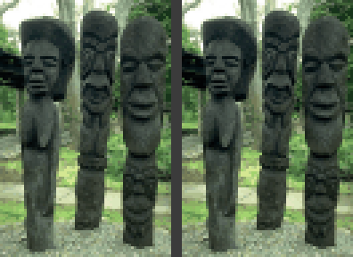
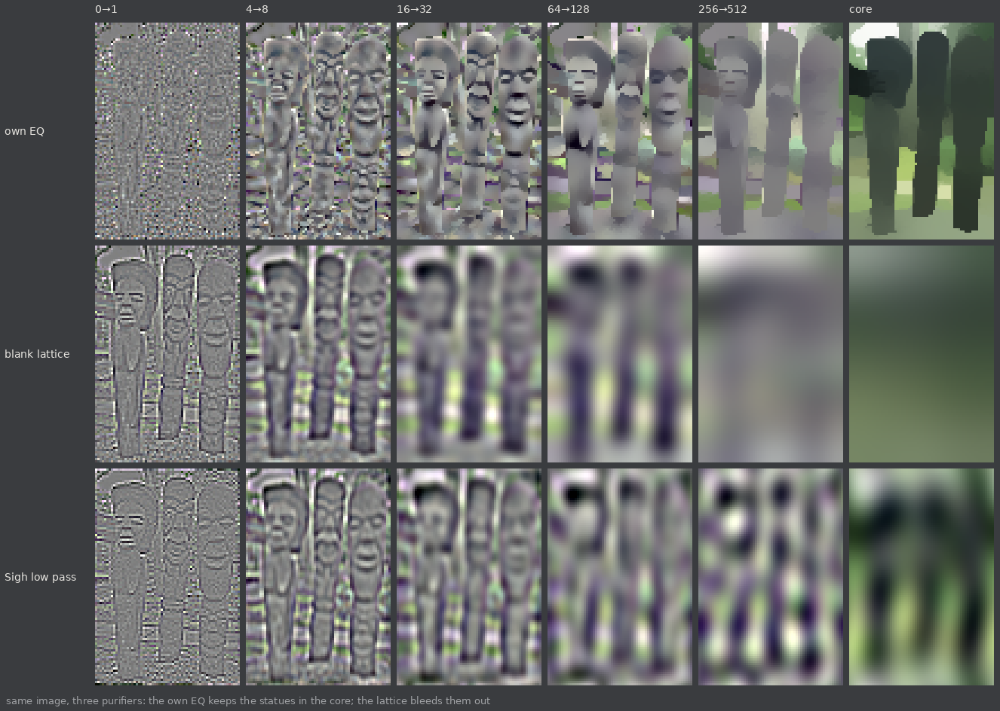
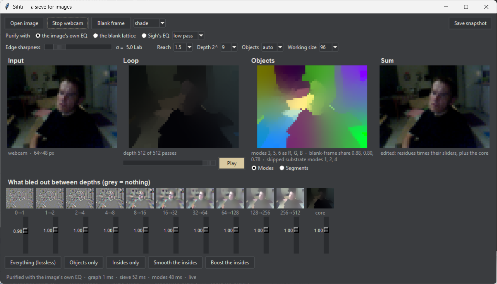
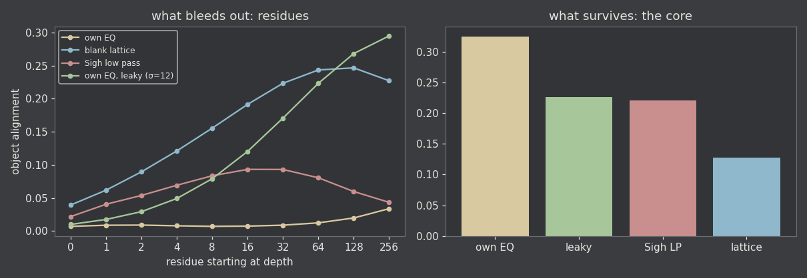

# Sihti

Sihti (Finnish for a fine sieve) runs the SighImageSuper loop but keeps what dies. Between depths 0, 1, 2, 4, … it saves whatever bled out; add the residues back to the surviving core and you get the input exactly. The same sieve takes any purifier, and the purifier decides what "persistence" means — frequency for Sigh's EQ, object grouping for the image's own colour graph, where the layout stays in the core and the insides bleed into the residues.



[SighImageSuper](https://github.com/anttiluode/SighImageSuper) fed an image back through a fixed EQ again and again and watched it die into a checkerboard. Sihti keeps what dies. Between the depths 0, 1, 2, 4, …, 512 it saves whatever bled out. Add those residues back to the last state and you get the input exactly.

The same machinery takes any purifier, and the purifier decides what "persistence" means:

- with **Sigh's EQ** it means frequency;
- with **the blank lattice** (plain diffusion on the pixel grid) it means scale: object edges bleed out and what survives is a blur;
- with **the image's own EQ**, where every pixel is coupled to its neighbours by how alike they look, what survives is the layout of the objects and what bleeds out is what is inside them.



## Run it

```
pip install numpy scipy pillow opencv-python
python sihti_live.py              # starts on a built-in scene
python sihti_live.py photo.jpg    # or on your own image
```

On Windows you can double-click `run_sihti.bat`. OpenCV is only needed for the webcam.



- **Input** is the working image. It is small on purpose (96 px by default): this is an instrument, not a filter.
- **Loop** is the image purified to the depth on the slider. Space plays the movie.
- **Objects** shows the slowest modes of the image's own EQ painted as colour, or the segments they give. Modes that a blank frame also has are skipped, and each painted mode's blank-frame share is printed.
- **Sum** is every residue times its slider, plus the core. With all sliders at 1 you get the input back, and the error is printed.
- **The strip** is what bled out between depths, one slider each. With the image's own EQ the presets are useful as they are: *Objects only* is a cartoon of the layout, *Smooth the insides* removes texture but keeps edges, and *Boost the insides* is an edge-aware clarity effect.

Keys: space plays, o opens, w starts the webcam, b loads a blank frame, s saves a snapshot, and 1, 2, 3 switch purifier.

## The identity

```
R_j = x(d_j) - x(d_j+1)        depths d = 0, 1, 2, 4, ..., 2^J
x0  = R_0 + R_1 + ... + R_J + core
```

This holds for any sequence of states: a linear or nonlinear purifier, a purifier that changes every pass, even a noisy one. An imperfect purifier changes what the channels *mean*; it cannot make the sum lossy. So the inverse is plain addition, and it does not need to know which operator made the residues.

Depths are octaves because a mode with per-pass gain g spreads thinly over about 1/(1−g) single-pass residues.

## Gates

| gate | claim | result | numbers |
|---|---|---|---|
| G0 | the sum gives back the input, for any purifier | **PASS** | worst error 1.1e-16 over 154 cases: own EQ, lattice, five Sigh presets, alternating EQs, rebuilt (nonlinear), median, noisy |
| G1 | a fixed Fourier EQ gives no new axis | **PASS** | every slider setting equals one frequency EQ to 6e-14 (63 cases); on Sigh's 64×64 field: 4096 bins, 457 distinct k², at most 159 reachable gains |
| G2 | a blank frame leaves only the substrate | **PASS** | own EQ on a blank frame equals the lattice exactly; lattice modes 1–2 lie in the cosine span at 0.99999 and 0.99998; the checkerboard has eigenvalue −1 in the plain 4-neighbour walk (still at amplitude 1.0 after 100 passes) and dies in one lazy pass |
| G3a | the own EQ segments objects better than colour k-means | **PASS** | covering 0.446 vs 0.404; better on 131, worse on 67 of 198; sign test p = 6.3e-06 |
| G3b | …and better than Felzenszwalb–Huttenlocher | **FAIL** | covering 0.446 vs 0.524; better on 56, worse on 142; p = 8.4e-10 |
| G4a | the core holds the objects | **PASS** | core alignment: own EQ 0.325, lattice 0.127 (Sigh low pass 0.221, leaky own EQ 0.226); own EQ higher on 96%; p = 2.6e-46 |
| G4b | the residues hold the insides | **PASS** | late-residue alignment: own EQ 0.017, lattice 0.226 (Sigh low pass 0.074, leaky own EQ 0.215); own EQ lower on 97%; p = 1.2e-50 |

G3 and G4 were pre-registered in [PREREG.md](PREREG.md), committed as `28bbd41` before any full benchmark run. That file also records what was looked at before then and why two test images are excluded. One process note: the k-means used everywhere was vectorised for speed before the val run that produced these numbers. An earlier val run, killed at 12 of 100 images, was discarded, not merged.

## The benchmark

198 BSDS500 test images at 120 px. Every method was tuned on the 100 val images with one setting for the whole split, then scored once on test. Covering is averaged over the human segmentations of each image.

| method | tuned setting | val covering | test covering | ARI | VI (lower is better) | segments |
|---|---|---|---|---|---|---|
| Sihti: slow modes, NJW (primary) | reach 1.5, σ 3, k 6 | 0.467 | 0.446 | 0.331 | 1.44 | 6.0 |
| Sihti: slow modes, substrate skipped | reach 3, σ 3, k auto | 0.464 | 0.473 | 0.398 | 1.45 | 8.7 |
| Sihti: k-means on the core | reach 3, σ 3, k 4, position weight 0 | 0.463 | 0.466 | 0.395 | 1.56 | 4.0 |
| k-means on Lab + position | k 3, position weight 0 | 0.400 | 0.404 | 0.290 | 1.81 | 3.0 |
| Felzenszwalb–Huttenlocher | scale 300, min size 60, σ 0.5 | 0.522 | 0.524 | 0.451 | 1.49 | 17.5 |

Cohesion clearly beats colour clustering (0.446 vs 0.404), and it loses to Felzenszwalb–Huttenlocher (0.446 vs 0.524), as the pre-registration expected. This is the same ordering Arbeláez et al. reported in 2011 at full resolution: normalized cuts 0.45, Felzenszwalb–Huttenlocher 0.52. So v0's segmentation is not a contribution. The instrument does not depend on it. One thing the registered rule does not cover: val picked the plain slow-mode version by 0.003, but on test the version that skips substrate modes scored higher (0.473). That is suggestive, not a result, and it is still well below Felzenszwalb–Huttenlocher.

G4 is the result the instrument rests on, and it held on held-out images. The own EQ keeps the objects in what survives (core alignment 0.325 vs 0.127 for plain diffusion). It bleeds out what is inside them: its late residues align with objects at 0.017, where the lattice's do at 0.226. Plain diffusion does the opposite, and Sigh's low-pass EQ sits in between. Which operator purifies decides where the objects go.



## Corrections made on the way

1. **At sharp edges the part–whole hierarchy is not in the residues.** The chat that started this repo predicted that the residues of the own-EQ loop would show small parts merging first, then objects, then the scene. At sharp edges (σ ≤ 5) the objects never merge within 512 passes. They stay in the core, and the residues carry texture and shading. The hierarchy only starts to show in the late residues when the edges are made leaky (σ = 12).
2. **The first G4 metric rewarded blur.** "Fraction of a residue's energy that varies inside the human segments" scores any smooth field as object-shaped. Before the confirmatory run it was replaced by the same fraction measured against the human segmentation rotated 180° (same region sizes, wrong place), minus the fraction against the real one.
3. **Persistence is not a new axis for a fixed Fourier EQ** (G1). Every slider setting is one frequency EQ whose curve is a polynomial of Sigh's curve. On Sigh's own 64×64 field at most 159 distinct gains are reachable. A new axis needs an operator that is not a fixed Fourier multiplier.
4. **The slowest modes are not always objects.** A large uniform region has internal slow modes (smooth cosines) that can be slower than a small object's boundary. The blank-frame check catches them. On a polar-bear photo at σ = 4, mode 2 is the bear (blank-frame share 0.27) and mode 3 is a left-right cosine across the snow (share 0.97). The app skips such modes when painting.

## What it is, honestly

Every piece here is published, some of it for forty years.

- **The linear sieve** is an undecimated Laplacian pyramid (Burt & Adelson 1983, [doi:10.1109/TCOM.1983.1095851](https://doi.org/10.1109/TCOM.1983.1095851)). The retina computes its first residue: centre minus surround is roughly the image minus a local blur (Srinivasan, Laughlin & Dubs 1982, [doi:10.1098/rspb.1982.0085](https://doi.org/10.1098/rspb.1982.0085)).
- **The image's own EQ** is edge-aware diffusion, the family of anisotropic diffusion (Perona & Malik 1990) and the bilateral filter (Tomasi & Manduchi 1998). The sliders do what edge-preserving multiscale decompositions were built for: tone and detail manipulation (Farbman, Fattal, Lischinski & Szeliski 2008).
- **Slow modes as groups** is normalized cuts (Shi & Malik 2000, [doi:10.1109/34.868688](https://doi.org/10.1109/34.868688)), discretised as in Ng, Jordan & Weiss 2001. See von Luxburg 2007 ([doi:10.1007/s11222-007-9033-z](https://doi.org/10.1007/s11222-007-9033-z)) for a tutorial. Stopping the loop before the trivial end is power iteration clustering (Lin & Cohen 2010). Residues of dyadic diffusion on a data-built graph are diffusion wavelets (Coifman & Maggioni 2006, [doi:10.1016/j.acha.2006.04.004](https://doi.org/10.1016/j.acha.2006.04.004)).
- **Sieves** keep what each mesh catches: Matheron's granulometry (1975) and Bangham's sieve decomposition (1996).
- **The attackers and the data** are Felzenszwalb & Huttenlocher 2004 ([doi:10.1023/B:VISI.0000022288.19776.77](https://doi.org/10.1023/B:VISI.0000022288.19776.77)) and BSDS500 (Arbeláez, Maire, Fowlkes & Malik 2011, [doi:10.1109/TPAMI.2010.161](https://doi.org/10.1109/TPAMI.2010.161)).

What may be new is the framing, not the parts: a live instrument where the same sieve runs three operators side by side, and the measurement of *where the objects go* (the core or the residues) as the thing that tells operators apart.

Limits:

- The images are low resolution.
- The affinity uses colour only, so stripes and zebras shatter.
- The "objects" are appearance groups, not meanings: a red shirt and blue trousers are two objects.

## Lineage

- **[SighImageSuper](https://github.com/anttiluode/SighImageSuper).** Sihti takes its loop and its EQ (`FourierEQ` copies `sigh_image_live_loop.py` exactly: 10 bands, looked up by normalised k², same presets). Sigh's checkerboard turns out to be the pixel lattice's own bipartite mode (G2).
- **[Tuesday](https://github.com/anttiluode/Tuesday).** In T5 a nonlinear sensor broke x = As, and linear ICA fell from ~1.0 to ~0.67. Occlusion is a nonlinear sensor, which is why PCA or ICA on sums cannot pull occluding objects apart, and why Sihti groups by cohesion instead.
- **[MovingProblem](https://github.com/anttiluode/MovingProblem).** The eigenvectors come out as an arbitrary rotation of the objects, the same indeterminacy as in blind source separation. The live mode's colour stabilisation is continuous frame matching, so MovingProblem's holonomy warning applies: it can come back rotated after a closed path. Nothing downstream relies on it.
- **[AnttisVideoFX2](https://github.com/anttiluode/AnttisVideoFX2).** Frequency bands did not carry separate lifetimes in real video; three of four died together. That is why a world model built on Sihti should give lifetimes to objects, not bands.
- **morphogen.py.** With the world removed, that loop converged to the pixel grid. Here too, long loops end on the substrate, and the scene lives in the transient and the residues.


## AI branch: can the sieve buy diffusion compute?

There is now a separate **manual GPU experiment** rather than a speed claim.

The first SDXL-Turbo prototype contained an exact identity:

```text
residue = draft - core
core + residue = draft
```

and both gains were fixed at 1. So the Core and Residue panels could change
dramatically while the diffusion model still received the original draft.

`sihti_ai_live.py` fixes that by exposing **Residue Back α**:

```text
α = 0.0  core only
α = 0.5  restore half the residue
α = 1.0  exact draft identity
```

The first GPU gate is pre-registered in [AI_GATE0.md](AI_GATE0.md). It compares
cheap refinement from the raw draft, Sihti core, half-restored residue, and a
Gaussian blur matched to the same draft→core distortion. It records direct
512×512 latency, draft/sieve/refinement latency, layout PSNR, edge correlation,
and the exact telescoping identity error.

Run it on a CUDA machine with SDXL-Turbo cached:

```bash
pip install -r requirements-ai.txt
python ai_gate0_sdxl_turbo.py --local-only
```

A heavier receipt:

```bash
python ai_gate0_sdxl_turbo.py --local-only --seeds 100 101 102
```

AI-G0 has now been run on an RTX 3060 across 3 prompts × 3 seeds. The
causal identity passes, but the global-core representation and speed claims
both fail: raw cheap refinement beats Sihti core on the declared layout/edge
metrics, and direct 512×512 SDXL-Turbo is faster than the draft→sieve→refine
route.

That negative result is kept. The next gate is not more tuning of the same
hypothesis. [AI_GATE1.md](AI_GATE1.md) tests whether residue energy can instead
predict **where** extra diffusion work is needed, which is the bridge to
WhatToLookAt-style local compute allocation.

## Next: v1, common fate (not built)

Add a slow state that pulls together colours that moved together, and let it write the operator. The demo: stand still and the loop splits you into face, shirt and trousers. Walk across the room, and the co-motion writes the EQ. Stand still again and you are one object.

Kill conditions, fixed now:

- the background must not merge;
- the merge must hold when you stop somewhere else in the room;
- it must beat an attacker that only remembers where the moving blob was.

## Files

```
sihti/            the package (numpy, scipy, pillow)
  graph.py        the image's own EQ: a pixel graph with weights refilled per image
  purifiers.py    Sigh's Fourier EQ, graph diffusion, two nonlinear purifiers
  sieve.py        the telescoping residue stack and the persistence EQ
  modes.py        slow modes, painting, segments, substrate share
  pipeline.py     analyse(): the whole instrument in one call
sihti_live.py     the live app (tkinter)
gates.py          G0-G2  -> results/GATES.json
bench_bsds.py     G3-G4 on BSDS500 -> results/BSDS_VAL.json, results/BSDS_TEST.json
make_figures.py   figures/
tests/            pytest
```

Reproduce: `python gates.py`, then `python bench_bsds.py --bsds <BSDS500>/data --phase val`, then `--phase test`. BSDS500 is mirrored at [github.com/BIDS/BSDS500](https://github.com/BIDS/BSDS500).
